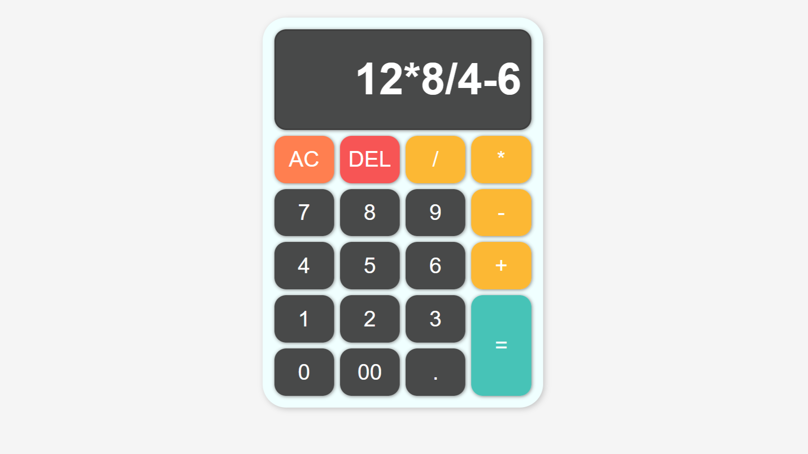
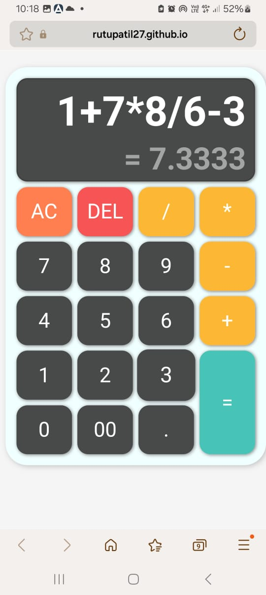

# 🧮 Arithmetic Calculator

A simple, responsive, and interactive web-based calculator built using **HTML**, **CSS**, and **JavaScript** as part of the **CodeAlpha internship project**.

## 🚀 Features

- ✨ Clean and modern UI using CSS Grid
- 🧠 Real-time result display while typing
- ⌨️ Full keyboard support (numbers, operators, backspace, enter)
- 🎯 Responsive design suitable for mobile and desktop
- 🔒 Error handling for invalid expressions
- 🔢 Result formatting — automatically rounds to 4 decimal places when needed

## 📸 Preview

### 💻 Desktop View

### 📱 Mobile View

## 🌐 Live Demo

🔗 [Click here to try the calculator live]([https://your-username.github.io/your-repo-name/](https://rutupatil27.github.io/CodeAlpha_Basic-Calculator/))

## 🔧 Tech Stack

- HTML5
- CSS3
- JavaScript (Vanilla)
